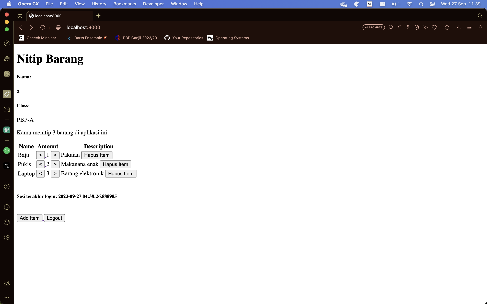
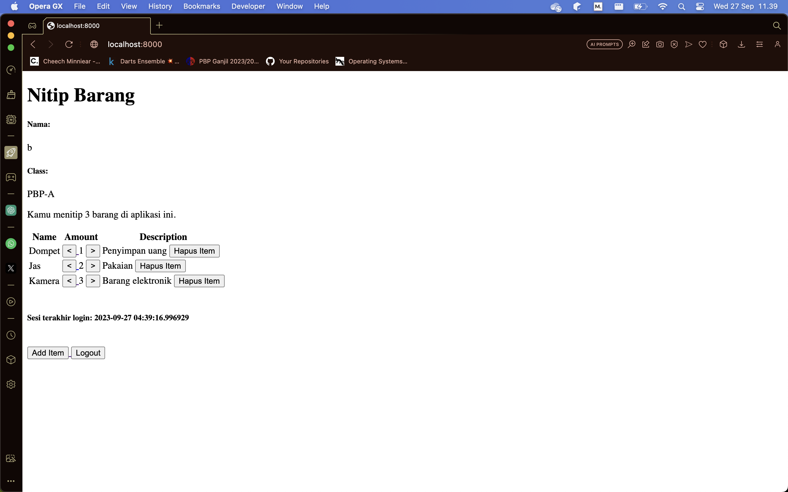
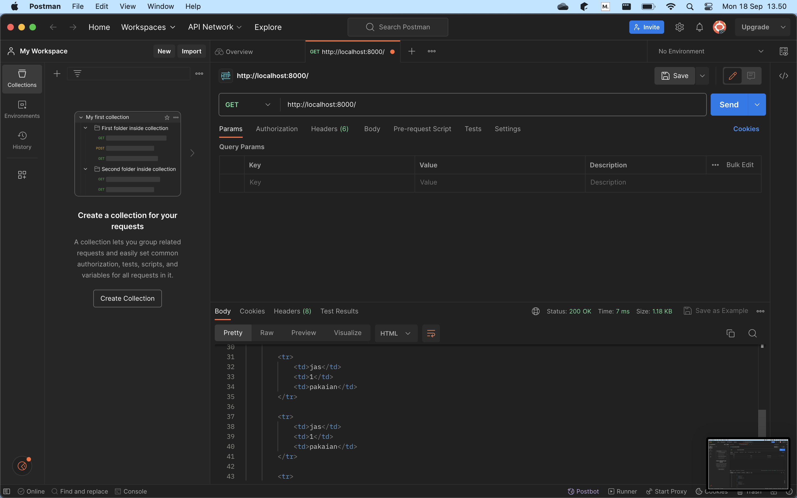
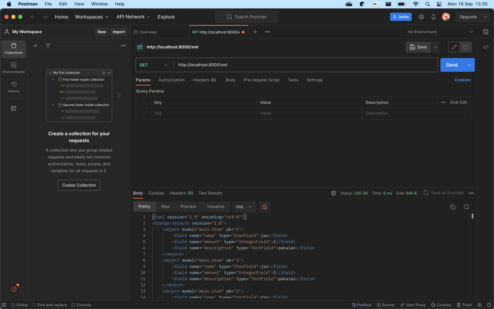
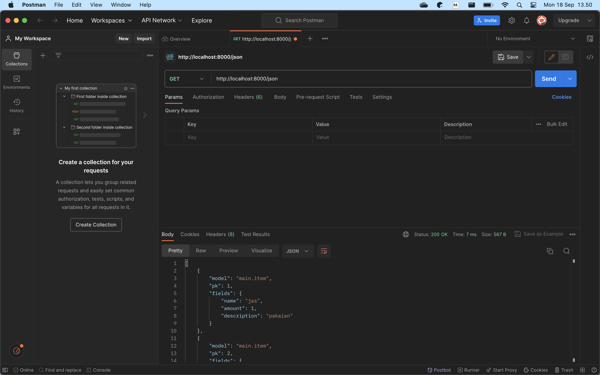
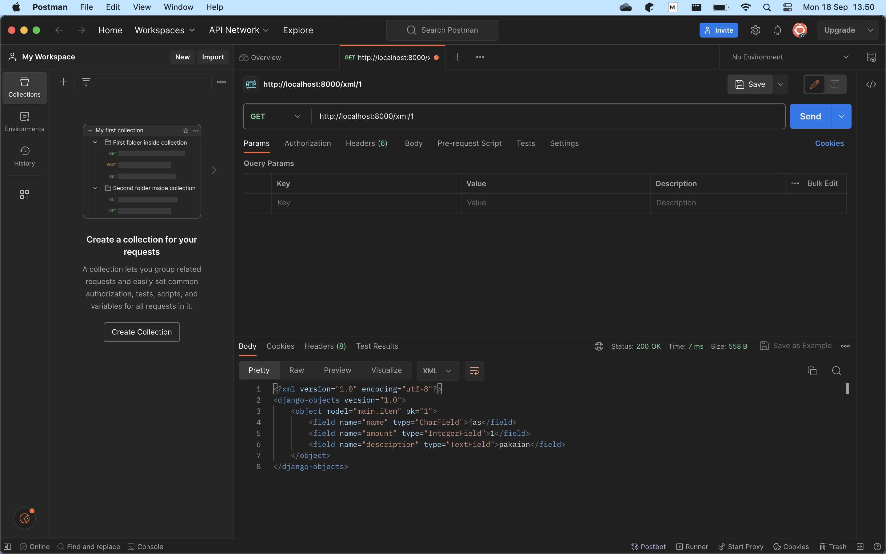
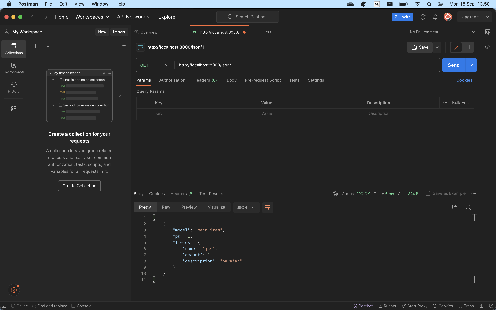

#### nama:  Febrian Irvansyah  
#### kelas:  PBP A

# Pemrograman Berbasis Platform🐼

## Tugas 4: Implementasi Autentikasi, Session, dan Cookies pada Django
<details>
<summary>Click for more detail</summary>
<br>

#### 1️⃣ Apa itu Django UserCreationForm, dan jelaskan apa kelebihan dan kekurangannya?
UserCreationForm adalah sebuah modul bawaan dari sistem autentikasi Django. Fungsi utama dari UserCreationForm adalah membuat objek user baru tanpa privilage.
##### Kelebihan dari UserCreationForm:
- Penggunaannya yang sangat simpel. UserCreationForm akan membantu pengembang untuk mempersingkat waktu dalam skema pembuatan user karena sudah mencakup semua elemen dasar dari registrasi user seperti memasukkan username, password, dan password confirmation.
- Sudah terhubung dengan sistem autentikasi django sehingga pengembang mudah dalam melakukan pembuatan sistem seperti login.
- UserCreationForm sudah mengimplementasikan langkah untuk menjaga keamanan user. Data yang diinput user seperti password disimpan tidak dalam bentuk plaintext pada database django dan sudah terdapat sistem untuk menghindari serangan peretas seperti XSS.
##### Kekurangan dari UserCreationForm:
- Implementasi dari pembuatan user masih sederhana seperti username dan password sehingga diperlukan penambahan secara manual untuk nama belakang dan email.
- Diperlukan implementasi tambahan lebih lanjut oleh pengembang jika ingin membuat password yang lebih aman seperti harus terdapat karakter spesial.
- Tidak melakukan validasi email apakah sudah benar atau tidak.
- Registrasi sangat sederhana karena hanya terdiri dari satu tahap dan perlu dilakukan secara manual jika ingin menambah tahap lain.

#### 2️⃣ Apa perbedaan antara autentikasi dan otorisasi dalam konteks Django, dan mengapa keduanya penting?
Autentikasi adalah proses pemerikasaan atau verifikasi apakah user ada dan memiliki data yang sesuai dengan yang diinputkan. Proses autentikasi penting untuk memastikan setiap orang yang ingin mengakses aplikasi web memiliki hak akses pada website tersebut yang akan berhubungan dengan otorisasi. Otorisasi adalah proses penenetuan tindakan atau hak akses apa saja yang dapat dilakukan oleh user yang sudah terautentikasi. Pentingnya otorisasi adalah pemisahan hak sesuai jabatan/role sehingga menciptakan keteraturan dalam penggunaan aplikasi web dan melindungi dari akses yang berusaha untuk mengubah website tanpa jabatan yang sesuai.

#### 3️⃣ Apa itu cookies dalam konteks aplikasi web, dan bagaimana Django menggunakan cookies untuk mengelola data sesi pengguna?
Cookie dalam aplikasi web adalah suatu bentuk kumpulan informasi yang didapatkan dari rekam jejak aktivitas yang pernah dilakukan user pada aplikasi web tersebut. Pada Django cookies dikelola melalui method dari HttpResponse. Untuk menyimpan suatu cookie dilakukan method set_cookie() pada HttpResponse dengan parameter key dan value yang nilainya dapat diakses melalui request.COOKIES['key']. Untuk menghapus suatu cookie dilakukan method delete_cookie('key) yang biasa dilakukan apabila sesi pengguna telah selesai.

#### 4️⃣ Apakah penggunaan cookies aman secara default dalam pengembangan web, atau apakah ada risiko potensial yang harus diwaspadai?
Secara default penggunaaan cookies aman dalam pengembangan web. Cookies biasa disimpan oleh komputer pribadi user yang memiliki unique id. Oleh karena itu, data yang terdapat pada cookie hanya dapat diakses oleh pemilik komputer itu sendiri kecuali pengguna itu sendiri yang memberikan akses terhadap data pribadinya. Informasi yang tersimpan pada cookie secara default bukan digunakan untuk melakukan peretasan, melainkan cookie digunakan sebagai pengingat website jika user pernah mengunjungi website tersebut sehingga website dapat membuat laman yang lebih personal terhadap preferensi user tersebut. Namun, tentu saja terdapat risiko yang terjadi dalam penggunaan cookie contohnya dalam skema peretasan Man-in-the-middle. Dalam peretasan tersebut, peretas akan mencoba untuk menangkap data user ditengah pengaksesan user terhadap website. Dengan hal tersebut, peretas bisa mendapat cookie data user karena user secara tidak langsung juga memberi akses terhadap cookie karena pengaksesan website yang membutuhkan unique id.

#### 5️⃣ Jelaskan bagaimana cara kamu mengimplementasikan checklist di atas secara step-by-step (bukan hanya sekadar mengikuti tutorial).

##### ✅ Mengimplementasikan fungsi registrasi, login, dan logout untuk memungkinkan pengguna untuk mengakses aplikasi sebelumnya dengan lancar.
- Menambah fungsi registrasi, login, dan logout pada views.py
- Pada fungsi registrasi memanfaatkan method pada UserCreationForm yang telah diimport untuk menambah user baru. Pada fungsi ini akan memastikan pengisian pada form valid atau tidak serta akan redirect pada login jika sudah benar. Pada fungsi ini merender register.html yang telah dibuat templatenya.
- Pada fungsi login_user akan memanfaatkan fungsi authenticate dan login yang diimport untuk mengautentikasi input user berupa username dan password. Jika user ditemukan maka akan redirect pada show_main. Pada fungsi ini merender login.html yang templatenya telah dibuat.
-Pada fungsi logout_user akan memanfaatkan fungsi logout yang diimport sebagai fungsi yang menghapus sesi pengguna saat ini. Pada fungsi ini akan memanggil fungsi logout dengan parameter request serta redirect pada login page.

##### ✅ Membuat dua akun pengguna dengan masing-masing tiga dummy data menggunakan model yang telah dibuat pada aplikasi sebelumnya untuk setiap akun di lokal.
- Melakukan registrasi 2 akun.
- Login pada masing-masing akun dan menambahkan 3 item baru pada masing-masing akun.
- Akun A

- Akun B


##### ✅ Menghubungkan model Item dengan User.
- Import User pada models.py dan menambah atribut user pada Item dengan menggunakan method ForeignKey berparameter User.
- Hubungkan fungsi-fungsi pada views.py dengan model user seperti pada fungsi add_item dan show_main yang memfilter item berdasarkan user yang login saja.
- Lakukan command makemigrations dan migrate pada manage.py

##### ✅ Menampilkan detail informasi pengguna yang sedang logged in seperti username dan menerapkan cookies seperti last login pada halaman utama aplikasi.
- Untuk mendapat informasi pengguna, pada fungsi show_manin telah memfilter item sesuai user yang sedang login. Pada dictionary context dilakukan penambahan variable sesuai data yang personalized dalam kasus ini adalah username yang dapat diambil dari data user.
- Untuk menambah fitur last login maka mengimport fungsi datetime lalu melakukan set_cookie dengan key 'last_login' dan valuenya berisi datetime sekarang yang kodenya disematkan pada saat user melakukan login.
- Pada fungsi show_main dictionary context akan menambahkah key last_login dengan value request_COOKIES['last_login']
- Menampilkan last login pada template dengan {{ last_login }}
- Pada fungsi logout dilakukan delete_cookie('last_login') yang menandakan akhir sesi

#### 6️⃣ Bonus
- Membuat tombol dan fungsi untuk mengurangi dan menambahkan item.
- Membuat tombol dan fungsi untuk menghapus item.
</details>


## Tugas 3: Implementasi Form dan Data Delivery pada Django
<details>
<summary>Click for more detail</summary>
<br>

#### 1️⃣ Apa perbedaan antara form POST dan form GET dalam Django?
GET dan POST adalah method HTTP yang mengurus input form. Kedua method tersebut dibedakan dari segi bagaimana form ditransimisikan. Method POST akan memproses data dengan mengenkripsinya terlebih dahulu, mengirim ke server, dan menerima respon. Selain itu, method POST memiliki kelebihan dari segi besar data karena tidak ada pembatasan yang berhubungan dengan URL. Method GET memproses data menjadi sebuah string yang akan muncul pada string query di URL yang menunjukkan kemana data akan dikirim serta berisi data key-value. Method GET memiliki keterbatasan dalam kapasitas karena berhubungan dengan URL yang dibatasi. Oleh karena itu, penggunaannya akan berbeda karena terdapat perbedaan yang jelas dari segi security dan jenis data yang dikirimkan. POST cenderung digunakan untuk data sensitif yang membutuhkan proteksi atau untuk data yang memiliki ukuran besar seperti gambar, Sedangkan GET digunakan untuk menerima data yang tidak sensitif dan berukuran tidak besar.

#### 2️⃣ Apa perbedaan utama antara XML, JSON, dan HTML dalam konteks pengiriman data?
XML dan JSON adalah suatu format untuk menyimpan atau mengirim data. HTML adalah suatu markup language yang umunya digunakan untuk mendisplay suatu tampilan situs web. Dalam konteks pengiriman data, HTML memiliki atribut \<form> yang berfungsi untuk menentukan bagaimana data akan ditransmisikan ke server (GET/POST). Sedangkan untuk XML dan JSON digunakan untuk sebagai sebuah tempat penyimpanan dari data yang telah ditransmisikan. Perbedaan JSON dan XML adalah bagaimana notasi dalam penyimpanan datanya. XML adalah sebuah markup language. Oleh karena itu, XML akan menggunakan tag dan marker untuk menunjukkan jenis konten yang human readable serta deskriptif, lalu terdapat nesting yang menunjukkan hubungan antar data. JSON menggunakan data interchange format yang dimana JSON akan menggunakan {"key":"value"} format untuk menunjukkan hubungan antar data. Maka dapat disimpulkan bahwa pembeda utama dalam XML dan JSON adalah terletak pada seberapa compact penulisannya. Compactnya penulisan ini akan berpengaruh dalam fleksibilitas dalam penggunaan data.

#### 3️⃣ Mengapa JSON sering digunakan dalam pertukaran data antara aplikasi web modern?
Penulisan JSON yang simpel yaitu menggunakan format key dan value menyebabkan JSON memiliki beberapa keunggulan berikut:
- Ukuran yang ringan dan compact sehingga mengurangi beban komunikasi.
- Mudah untuk diubah ke dalam struktur data banyak bahasa pemrograman untuk melakukan pemrosesan data.
- Web modern kemungkinan besar akan menggunakan JavaScript dalam pengembangannya. JSON memiliki keasamaan sintaks dengan format data dalam JavaScript.
- Dapat secara mudah dipahami oleh manusia.
- Mendukung hubungan antar data yang bertingkat.

#### 4️⃣ Jelaskan bagaimana cara kamu mengimplementasikan checklist di atas secara step-by-step (bukan hanya sekadar mengikuti tutorial).

##### ✅ Membuat input form untuk menambahkan objek model pada app sebelumnya.
- Membuat kerangka html dengan membuat folder templates yang berisi base.html pada root folder serta mencantukannya pada settings.py.
- Melengkapi kerangka yang terdapat pada base.html untuk kebutuhan aplikasi main berupa atribut form untuk menerima input user dan mendisplay hasil dari input tersebut.
- Membuat berkas baru bernama `forms.py` sebagai struktur form yang dapat menerima data.

##### ✅ Tambahkan 5 fungsi views untuk melihat objek yang sudah ditambahkan dalam format HTML, XML, JSON, XML by ID, dan JSON by ID.
- Fungsi dalam format HTML dilakukan sekaligus untuk menerima request yang diterima dalam parameter bernama `add_item` dan merender `add_item.html`
- Fungsi dalam format XML dan JSON menambahkan variable yang menyimpan objects pada item dan mereturn `HttpResponse ` yang isi parameternya adalah objects yang diserialisasi.
- Fungsi XML by ID dan JSON by ID sama implementasinya dengan XML dan JSON biasa namun untuk variable yang menyimpan objects menggunakan filter (pk=id) sehingga dapat diurutkan berdasarkan input.

##### ✅ Membuat routing URL untuk masing-masing views yang telah ditambahkan pada poin 2.
- Pada urls.py di folder main lakukan import terhadap setiap fungsi yang terdapat pada views.
- Untuk fungsi add_item, XML, dan JSON tambahkan path sesuai namanya.
- Untuk fungsi XML by ID dan JSON by ID path ditambahkan `<int:id>` untuk mendapatkan data sesuai idnya.

#### 5️⃣ Mengakses kelima URL di poin 2 menggunakan Postman, membuat screenshot dari hasil akses URL pada Postman, dan menambahkannya ke dalam README.md.

- HTML

- XML

- JSON

- XML by ID

- JSON by ID


#### 6️⃣ Bonus
Menambahkan pesan "Kamu menitip X barang di aplikasi ini." yang diimplementasikan pada main.html serta memanfaatkan method `.count` untuk mendapatkan nilai X.
</details>

## Tugas 2: Implementasi Model-View-Template (MVT) pada Django
<details>
<summary>Click for more detail</summary>
<br>

#### 1️⃣ Jelaskan bagaimana cara kamu mengimplementasikan checklist di atas secara step-by-step (bukan hanya sekadar mengikuti tutorial).
Ide implementasi dari tema aplikasi inventori yang saya pilih adalah aplikasi penitipan barang.

##### ✅ Membuat sebuah proyek Django baru:
- Membuat direktori baru bernama nitip-barang.
- Masuk ke dalam direktori dan membuat virtual environment python pada directory tersebut.
- Menjalankan command untuk menginstall dependencies pada virtual environment dan untuk membuat direktori proyek bernama nitip_barang.
- Mengkonfigurasi proyek Django agar dapat diakses oleh host sebagai aplikasi web.

##### ✅ Membuat aplikasi dengan nama main pada proyek tersebut:
- Menjalankan command `python manage.py startapp main` pada direktori utama untuk membuat aplikasi dengan nama main.
- Direktori aplikasi bernama main telah dibuat.

##### ✅ Melakukan routing pada proyek agar dapat menjalankan aplikasi main:
- Membuka settings.py pada direktori proyek dan menambah aplikasi `'main'` pada variabel `INSTALLED_APPS`.

##### ✅ Membuat model pada aplikasi main dengan nama Item dan memiliki atribut wajib sebagai berikut:
name sebagai nama item dengan tipe CharField.
amount sebagai jumlah item dengan tipe IntegerField.
description sebagai deskripsi item dengan tipe TextField.
- Membuka file models.py pada direktori aplikasi dan membuat class bernama Item dengan parameter model.Model.
- Menambah atribut class berupa nama dengan tipe CharField, amount dengan tipe IntegerField, dan deskripsi dengan tipe TextField.

##### ✅ Membuat sebuah fungsi pada views.py untuk dikembalikan ke dalam sebuah template HTML yang menampilkan nama aplikasi serta nama dan kelas kamu:
- Membuat direktori bernama `templates` pada direktori aplikasi main.
- Membuat file bernama main.html pada direktori templates yang berisi kode HTML yang akan menampilkan nama aplikasi, nama, dan kelas:
  ```markdown
  <h1>{{ nama_aplikasi }}</h1>

  <h5>Nama: </h5>
  <p>{{ nama }}</p>
  <h5>Class: </h5>
  <p>{{ kelas }}</p>
  ```
- Menambah fungsi show_main pada views.py di direktori aplikasi main untuk mengembalikan nilai nama aplikasi, nama, dan kelas:
  ```markdown
  def show_main(request):
    context = {
        'nama_aplikasi' : 'Nitip Barang',
        'nama': 'Febrian Irvansyah',
        'kelas': 'PBP-A'
    }

    return render(request, "main.html", context)
  ```
- Menjalankan command `python manage.py makemigrations` dan `python manage.py migrate` untuk melakukan membuat berkas migrasi dan mengaplikasikan perubahan model ke basis data.

##### ✅ Membuat sebuah routing pada urls.py aplikasi main untuk memetakan fungsi yang telah dibuat pada views.py.
- Masuk ke dalam file urls.py pada direktori aplikasi main untuk menulis kode rute url aplikasi main dan menandai fungsi yang digunakan:
  ```markdown
  from django.urls import path
  from main.views import show_main

  app_name = 'main'

  urlpatterns = [
      path('', show_main, name='show_main'),
  ]
  ```
- Masuk ke dalam file urls.py pada direktori proyek nitip_barang dan import fungsi `include` dari `django.urls`.
- Menambah pattern url untuk aplikasi main yang menunjuk pada direktori `main.urls`:
  ```markdown
  urlpatterns = [
    path('admin/', admin.site.urls),
    path('main/', include('main.urls'))
  ]
  ```
##### ✅ Melakukan deployment ke Adaptable terhadap aplikasi yang sudah dibuat sehingga nantinya dapat diakses oleh teman-temanmu melalui Internet.
- Melakukan inisiasi git pada direktori utama.
- Menambah konfigurasi user pada git.
- Menambah file .gitignore untuk file yang diabaikan.
- Membuat repositori baru pada github bernama `nitip-barang`.
- Membuat branch baru bernama `main` pada git dan menghubungkan repositori lokal dengan repositori yang telah dibuat pada github.
- Melakukan add, commit, dan push pada repositori github.
- Membuat new app pada adaptable menggunakan repositori github yang baru dibuat.
- Memilih opsi `Python App Template`, `PostgreSQL`, dan sesuaikan opsi dengan versi python yang digunakan pada aplikasi.
- Field `Start Command` diisi dengan `python manage.py migrate && gunicorn shopping_list.wsgi`
- Masukkan nama aplikasi sebagai domain, centang HTTP Listener, dan lakukan deploy.

#### 2️⃣ Buatlah bagan yang berisi request client ke web aplikasi berbasis Django beserta responnya dan jelaskan pada bagan tersebut kaitan antara urls.py, views.py, models.py, dan berkas html.


- Request client akan diterima melalui urls.py yang berisi suatu path tertentu. Path ini menunjukkan hubungan antara views.py dan urls.py, dimana views akan menerima request apabila path yang didapat sesuai dan bekerja sebagai logic layer.
- Antara views dan models berhubungan pada read dan write data, dimana models dapat digunakan untuk menyimpan data dari field dalam bentuk objek yaitu Models dan disalurkan ke views dan views dapat read data pada models untuk dilakukan logic operation menjembatani models dan template.
- Antara views dan template berhubungan dengan apa yang ditampilkan ke user, dimana template akan membentuk struktur dasar dari html dan views akan mengatur logic atau apa yang akan ditampilkan berdasarkan template yang telah ada.
- Diakhir views sebagai logic layer akan memberikan response berupa html yang bisa dilihat oleh user.

#### 3️⃣ Jelaskan mengapa kita menggunakan virtual environment? Apakah kita tetap dapat membuat aplikasi web berbasis Django tanpa menggunakan virtual environment?
Jawab:  
Fungsi virtual enviroment adalah untuk memisahkan antar proyek satu django satu dengan yang lainnya. Dengan memisahkan proyek, kita dapat secara mudah untuk mengatur segala bentuk kebutuhan atau dependencies yang ada pada proyek tersebut tanpa mempengaruhi proyek lain. Jawaban pertanyaan kedua adalah iya. Namun, hal ini akan mempersulit untuk mengatur proyek secara independen dan dapat memicu timbulnya konflik antar proyek. Dengan pemisahan maka kita juga dapat memilih secara tepat apa yang harus dilakukan pada proyek tersebut tergantung environmentnya. Hal tersebut karena setiap environment pasti kemungkinan akan memiliki pembeda seperti versi python, versi library, dll.

#### 4️⃣ Jelaskan apakah itu MVC, MVT, MVVM dan perbedaan dari ketiganya!
Jawab:  
Ketiga istilah adalah sebuah bentuk pattern arsitektur yang biasa digunakan dalam membangun perangkat lunak. Penggunaan pattern arsitektur yang baik akan menciptakan modularitas yang baik dalam menyatukan kerangka perangkat lunak.
- MVC(Model-View-Controller)
- MVT(Model-View-Template)
- MVVM(Model-View-ViewModel)

##### MVC:  
Pada MVC, Controller menjadi pemegang logic utama yang dimana controller akan melihat apa respon dari user pada view dan mengupdate data pada model yang sesuai logic yang telah ditentukan.
##### MVT:  
Pada MVT, View menjadi layer logic yang akan menjembatani hubungan antara data pada models dan struktur tampilan pada template.
##### MVVM: 
Pada MVVM, memisahkan View dari bagian layer logic. View akan berguna untuk memberikan suatu informasi apabila terjadi interaksi user kepada ViewMModel, Model akan berfungsi untuk menerima, menyimpan, atau memberi data pada ViewModel, dan ViewModel berfungai untuk melakukan pengeluaran data dari model yang akan dipilah relevansinya terhadap interaksi yang diterima oleh View.

Perbedaan utama dari ketiga arsitektur tersebut terletak pada logic layer yang berbeda dalam posisinya dalam menerima suatu data atau menerima suatu interaksi dari user.
</details>

