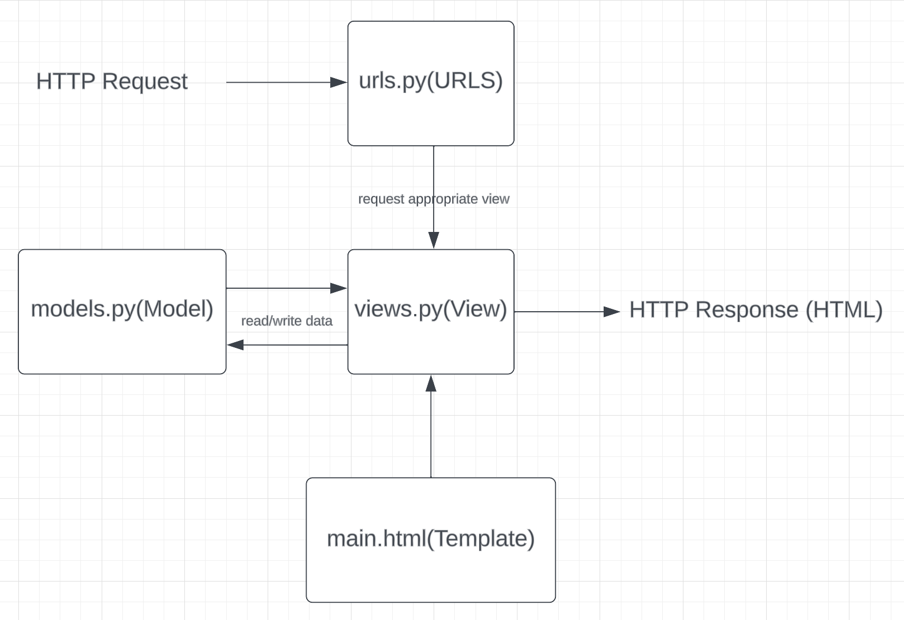

# Implementasi Model-View-Template (MVT) pada Django
nama:  Febrian Irvansyah  
kelas:  PBP A

### Jelaskan bagaimana cara kamu mengimplementasikan checklist di atas secara step-by-step (bukan hanya sekadar mengikuti tutorial).
Ide implementasi dari tema aplikasi inventori yang saya pilih adalah aplikasi penitipan barang.

##### ✅ Membuat sebuah proyek Django baru:
- Membuat direktori baru bernama nitip-barang.
- Masuk ke dalam direktori dan membuat virtual environment python pada directory tersebut.
- Menjalankan command untuk menginstall dependencies pada virtual environment dan untuk membuat direktori proyek bernama nitip_barang.
- Mengkonfigurasi proyek Django agar dapat diakses oleh host sebagai aplikasi web.

##### ✅ Membuat aplikasi dengan nama main pada proyek tersebut:
- Menjalankan command `python manage.py startapp main` pada direktori utama untuk membuat aplikasi dengan nama main.
- Direktori aplikasi bernama main telah dibuat.

##### ✅ Melakukan routing pada proyek agar dapat menjalankan aplikasi main:
- Membuka settings.py pada direktori proyek dan menambah aplikasi `'main'` pada variabel `INSTALLED_APPS`.

##### ✅ Membuat model pada aplikasi main dengan nama Item dan memiliki atribut wajib sebagai berikut:
name sebagai nama item dengan tipe CharField.
amount sebagai jumlah item dengan tipe IntegerField.
description sebagai deskripsi item dengan tipe TextField.
- Membuka file models.py pada direktori aplikasi dan membuat class bernama Item dengan parameter model.Model.
- Menambah atribut class berupa nama dengan tipe CharField, amount dengan tipe IntegerField, dan deskripsi dengan tipe TextField.

##### ✅ Membuat sebuah fungsi pada views.py untuk dikembalikan ke dalam sebuah template HTML yang menampilkan nama aplikasi serta nama dan kelas kamu:
- Membuat direktori bernama `templates` pada direktori aplikasi main.
- Membuat file bernama main.html pada direktori templates yang berisi kode HTML yang akan menampilkan nama aplikasi, nama, dan kelas:
  ```markdown
  <h1>{{ nama_aplikasi }}</h1>

  <h5>Nama: </h5>
  <p>{{ nama }}</p>
  <h5>Class: </h5>
  <p>{{ kelas }}</p>
  ```
- Menambah fungsi show_main pada views.py di direktori aplikasi main untuk mengembalikan nilai nama aplikasi, nama, dan kelas:
  ```markdown
  def show_main(request):
    context = {
        'nama_aplikasi' : 'Nitip Barang',
        'nama': 'Febrian Irvansyah',
        'kelas': 'PBP-A'
    }

    return render(request, "main.html", context)
  ```
- Menjalankan command `python manage.py makemigrations` dan `python manage.py migrate` untuk melakukan membuat berkas migrasi dan mengaplikasikan perubahan model ke basis data.

##### ✅ Membuat sebuah routing pada urls.py aplikasi main untuk memetakan fungsi yang telah dibuat pada views.py.
- Masuk ke dalam file urls.py pada direktori aplikasi main untuk menulis kode rute url aplikasi main dan menandai fungsi yang digunakan:
  ```markdown
  from django.urls import path
  from main.views import show_main

  app_name = 'main'

  urlpatterns = [
      path('', show_main, name='show_main'),
  ]
  ```
- Masuk ke dalam file urls.py pada direktori proyek nitip_barang dan import fungsi `include` dari `django.urls`.
- Menambah pattern url untuk aplikasi main yang menunjuk pada direktori `main.urls`:
  ```markdown
  urlpatterns = [
    path('admin/', admin.site.urls),
    path('main/', include('main.urls'))
  ]
  ```
##### ✅ Melakukan deployment ke Adaptable terhadap aplikasi yang sudah dibuat sehingga nantinya dapat diakses oleh teman-temanmu melalui Internet.
- Melakukan inisiasi git pada direktori utama.
- Menambah konfigurasi user pada git.
- Menambah file .gitignore untuk file yang diabaikan.
- Membuat repositori baru pada github bernama `nitip-barang`.
- Membuat branch baru bernama `main` pada git dan menghubungkan repositori lokal dengan repositori yang telah dibuat pada github.
- Melakukan add, commit, dan push pada repositori github.
- Membuat new app pada adaptable menggunakan repositori github yang baru dibuat.
- Memilih opsi `Python App Template`, `PostgreSQL`, dan sesuaikan opsi dengan versi python yang digunakan pada aplikasi.
- Field `Start Command` diisi dengan `python manage.py migrate && gunicorn shopping_list.wsgi`
- Masukkan nama aplikasi sebagai domain, centang HTTP Listener, dan lakukan deploy.

### Buatlah bagan yang berisi request client ke web aplikasi berbasis Django beserta responnya dan jelaskan pada bagan tersebut kaitan antara urls.py, views.py, models.py, dan berkas html.


- Request client akan diterima melalui urls.py yang berisi suatu path tertentu. Path ini menunjukkan hubungan antara views.py dan urls.py, dimana views akan menerima request apabila path yang didapat sesuai dan bekerja sebagai logic layer.
- Antara views dan models berhubungan pada read dan write data, dimana models dapat digunakan untuk menyimpan data dari field dalam bentuk objek yaitu Models dan disalurkan ke views dan views dapat read data pada models untuk dilakukan logic operation menjembatani models dan template.
- Antara views dan template berhubungan dengan apa yang ditampilkan ke user, dimana template akan membentuk struktur dasar dari html dan views akan mengatur logic atau apa yang akan ditampilkan berdasarkan template yang telah ada.
- Diakhir views sebagai logic layer akan memberikan response berupa html yang bisa dilihat oleh user.

### Jelaskan mengapa kita menggunakan virtual environment? Apakah kita tetap dapat membuat aplikasi web berbasis Django tanpa menggunakan virtual environment?
Jawab:  
Fungsi virtual enviroment adalah untuk memisahkan antar proyek satu django satu dengan yang lainnya. Dengan memisahkan proyek, kita dapat secara mudah untuk mengatur segala bentuk kebutuhan atau dependencies yang ada pada proyek tersebut tanpa mempengaruhi proyek lain. Jawaban pertanyaan kedua adalah iya. Namun, hal ini akan mempersulit untuk mengatur proyek secara independen dan dapat memicu timbulnya konflik antar proyek. Dengan pemisahan maka kita juga dapat memilih secara tepat apa yang harus dilakukan pada proyek tersebut tergantung environmentnya. Hal tersebut karena setiap environment pasti kemungkinan akan memiliki pembeda seperti versi python, versi library, dll.

### Jelaskan apakah itu MVC, MVT, MVVM dan perbedaan dari ketiganya!
Jawab:  
Ketiga istilah adalah sebuah bentuk pattern arsitektur yang biasa digunakan dalam membangun perangkat lunak. Penggunaan pattern arsitektur yang baik akan menciptakan modularitas yang baik dalam menyatukan kerangka perangkat lunak.
- MVC(Model-View-Controller)
- MVT(Model-View-Template)
- MVVM(Model-View-ViewModel)

##### MVC:  
Pada MVC, Controller menjadi pemegang logic utama yang dimana controller akan melihat apa respon dari user pada view dan mengupdate data pada model yang sesuai logic yang telah ditentukan.
##### MVT:  
Pada MVT, View menjadi layer logic yang akan menjembatani hubungan antara data pada models dan struktur tampilan pada template.
##### MVVM: 
Pada MVVM, memisahkan View dari bagian layer logic. View akan berguna untuk memberikan suatu informasi apabila terjadi interaksi user kepada ViewMModel, Model akan berfungsi untuk menerima, menyimpan, atau memberi data pada ViewModel, dan ViewModel berfungai untuk melakukan pengeluaran data dari model yang akan dipilah relevansinya terhadap interaksi yang diterima oleh View.

Perbedaan utama dari ketiga arsitektur tersebut terletak pada logic layer yang berbeda dalam posisinya dalam menerima suatu data atau menerima suatu interaksi dari user.


